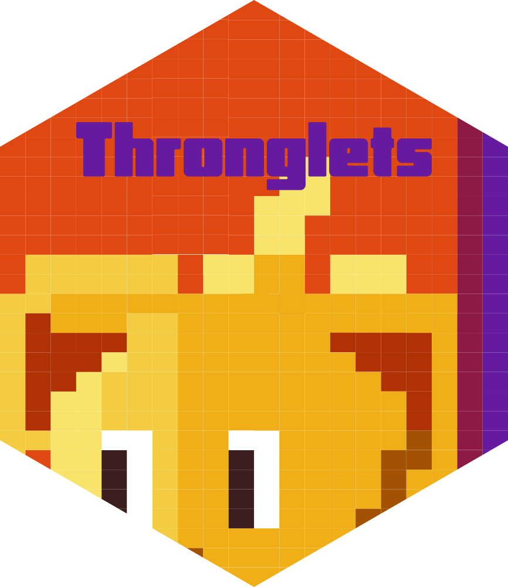
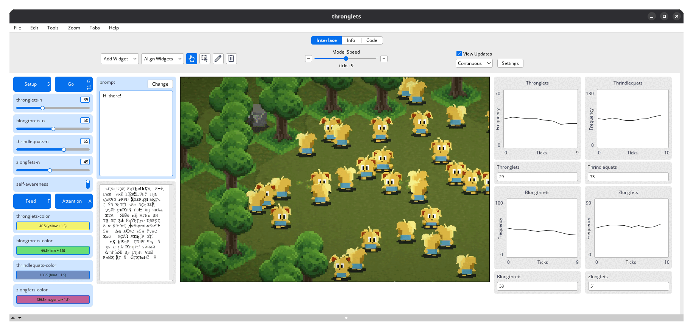
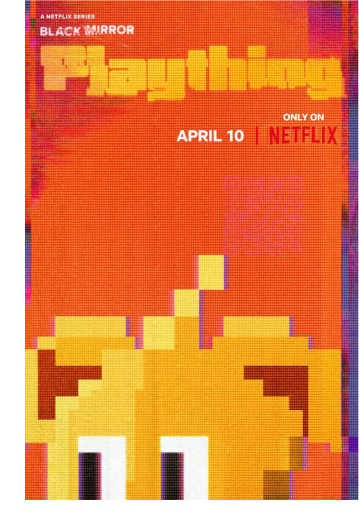

# Thronglets <a href = "https://github.com/danielvartan/logoshapes"></a>

<!-- badges: start -->
[](https://www.repostatus.org/#inactive)
[](https://www.gnu.org/licenses/gpl-3.0)
[](https://www.contributor-covenant.org/version/3/0/code_of_conduct/)
<!-- badges: end -->

## Overview

`Thronglets` is a [NetLogo](https://www.netlogo.org) model that simulates an adorably strange society of digital life forms. Each Thronglet goes about its own little life—eating, socializing, stressing out—and sometimes bands together with others to form collectives called Throngs. But they don't just live in their own world—they talk to you, in their weird little language.

Tweak the knobs, run the sim, and watch as strange civilizations rise, fall, and maybe whisper a bit too much.



## How to Use It

### Setup

To get started, ensure you have [NetLogo](https://www.netlogo.org) installed. This model was developed using NetLogo 7.0.3, so it is recommended to use this version or later.

### Downloading the Model

You can download the latest release of the model from its [GitHub
Releases page](https://github.com/danielvartan/thronglets/releases/latest).
For the development version, you can clone or download its [GitHub
repository](https://github.com/danielvartan/thronglets/) directly.

### Running the Model

Once everything is set, open the `thronglets.nlogox` file located in the
`nlogox` folder to start exploring!

## Jokes Aside...

<a href="https://www.imdb.com/title/tt0070544/">
  
</a>

`Thronglets` draws inspiration from the 2025 [Black Mirror](https://www.imdb.com/title/tt2085059/) episode [Plaything](https://www.imdb.com/title/tt31215636/), which explores interactions between humans and digital beings, as well as the emergence of a collective intelligence.

The interface is completely fictional and does not reflect actual software functionality. Visual frames are adapted from the [Thronglets game](https://play.google.com/store/apps/details?id=com.netflix.NGP.Venice&hl=en).

## How to Contribute

[](https://www.contributor-covenant.org/version/3/0/code_of_conduct/)

Contributions are always welcome! Whether you want to report bugs, suggest new features, or help improve the code or documentation, your input makes a difference.

Before opening a new issue, please check the [issues tab](https://github.com/danielvartan/thronglets/issues) to see if your topic has already been reported.

## License

[](https://www.gnu.org/licenses/gpl-3.0)

``` text
Copyright (C) 2025 Daniel Vartanian

Thronglets is free software: you can redistribute it and/or modify it under
the terms of the GNU General Public License as published by the Free Software
Foundation, either version 3 of the License, or (at your option) any later
version.

This program is distributed in the hope that it will be useful, but WITHOUT ANY
WARRANTY; without even the implied warranty of MERCHANTABILITY or FITNESS FOR A
PARTICULAR PURPOSE. See the GNU General Public License for more details.

You should have received a copy of the GNU General Public License along with
this program. If not, see <https://www.gnu.org/licenses/>.
```

